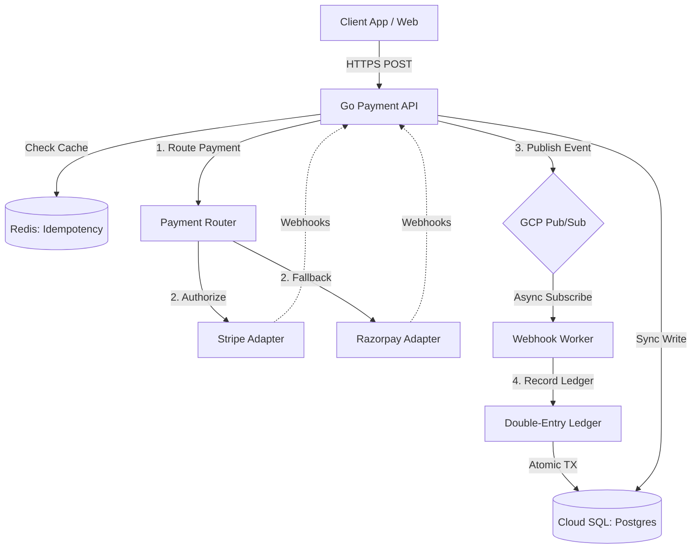
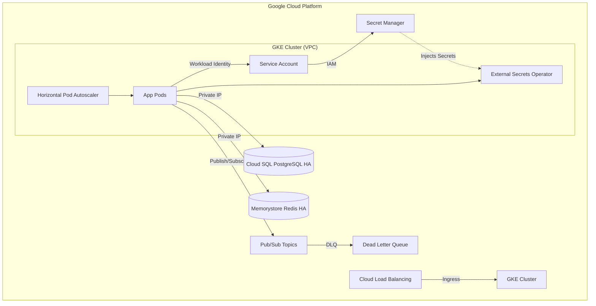
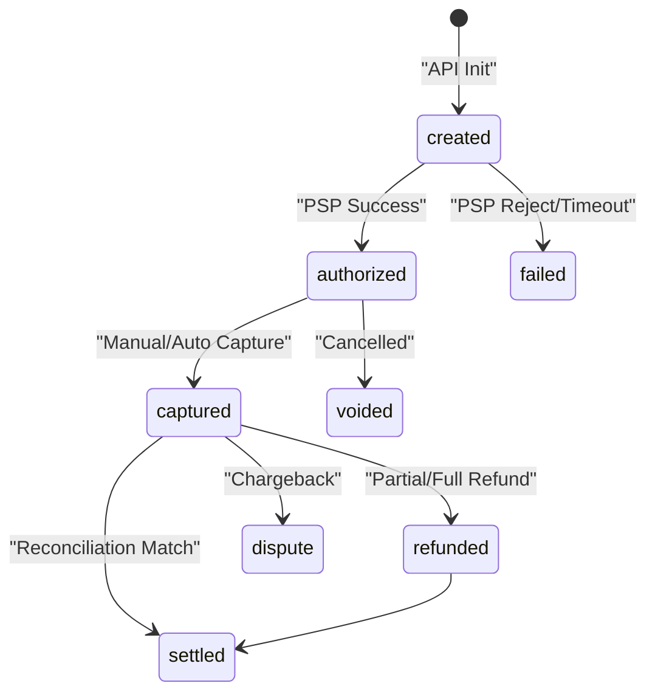

# Resilient Settlement Orchestrator

A production-grade **Payment Orchestration and Ledger System** built in Go that handles multi-PSP routing, double-entry bookkeeping, asynchronous webhook management, and automated reconciliation.

Built for scale, fault tolerance, and high availability on Google Cloud Platform using Google Kubernetes Engine, Cloud SQL, and Pub/Sub.

## Key Capabilities

* **Multi-PSP Abstraction** : Unified interface for Stripe, Razorpay, and other PSPs.
* **Intelligent Routing** : Rule-based payment routing with cost optimization and automatic fallback capabilities.
* **Double-Entry Ledger** : Financial-grade bookkeeping guaranteeing atomic consistency and balance integrity.
* **Resilience Patterns** : Circuit breakers, retries with exponential backoff, and distributed idempotency.
* **Asynchronous Webhook Processing** : High-throughput, signature-verified webhook handling with Dead Letter Queues (DLQ) via Google Cloud Pub/Sub.
* **Reconciliation Engine** : Automated detection of discrepancies between internal ledger records and external PSP settlements.
* **Complete Audit Trail** : Immutable records of every state transition, ledger entry, and incoming webhook.
* **Enterprise Security** : Google Workload Identity Federation, GCP Secret Manager integration, TLS/mTLS, and strict rate limiting.

## Technology Stack

| Domain | Technology |
|---|---|
| **Application Core** | Go 1.26, go-chi/chi v5 |
| **Database** | Google Cloud SQL (PostgreSQL 16), pgx v5 |
| **Caching & Idempotency** | Google Cloud Memorystore (Redis 7) |
| **Event Streaming** | Google Cloud Pub/Sub |
| **Infrastructure as Code** | Terraform |
| **Container Orchestration** | Google Kubernetes Engine (GKE) |
| **CI/CD pipeline** | GitHub Actions, Trivy Security Scans, Govulncheck |
| **Observability** | Cloud Monitoring, Prometheus Metrics, Structured JSON Logging |

## Architecture

### 1. High-Level System Flow



### 2. Cloud Infrastructure Diagram (GCP)



### 3. Payment State Machine



## API Endpoints

### Payment Operations
* `POST /v1/payments` : Create payment (Supports Idempotency-Key)
* `GET /v1/payments/{id}` : Retrieve payment status
* `POST /v1/payments/{id}/capture` : Capture an authorized payment
* `POST /v1/payments/{id}/refund` : Refund a captured payment
* `POST /v1/payments/{id}/cancel` : Cancel an authorized payment

### Ledger Operations
* `GET /v1/ledger/accounts/{code}/balance` : Get current account balance
* `GET /v1/ledger/entries` : View recent atomic ledger entries

### Admin and Reconciliation
* `POST /v1/webhooks/{psp}` : Ingest PSP webhooks
* `POST /v1/admin/reconciliation/{psp}` : Trigger manual reconciliation
* `GET /v1/admin/reconciliation/{id}/discrepancies` : View sync mismatches
* `GET /v1/admin/dlq` : View Dead Letter Queue
* `POST /v1/admin/dlq/retry` : Retry failed webhooks

## Security and Compliance

Security is baked into the infrastructure and application layers:
* **Keyless Authentication**: GCP Workload Identity Federation replaces long-lived service account JSON keys.
* **Secret Management**: GCP Secret Manager holds database passwords and PSP API keys. Kubernetes External Secrets Operator injects them as ephemeral environment variables.
* **Network Isolation**: Cloud SQL and Redis run on private IPs without public internet access.
* **Vulnerability Scanning**: CI/CD pipelines run Trivy and Govulncheck on every commit to block vulnerabilities from entering production.
* **Zero Trust APIs**: Strict Merchant API key validation and Rate Limiting (100 req/s) via Redis to prevent DDoS.

## Local Development Setup

To run the application locally using Docker Compose:

```bash
# 1. Clone the repository
git clone https://github.com/Slambot01/resilient-settlement-orchestrator.git
cd resilient-settlement-orchestrator

# 2. Setup Environment Variables
cp .env.example .env

# 3. Spin up the cluster
# This starts Postgres 16, Redis 7, Pub/Sub Emulator, and the Go App
docker-compose up -d --build

# 4. Verify Health
curl http://localhost:8080/healthz
```

## Performance Benchmarks

Load tested with [hey](https://github.com/rakyll/hey) using 10,000 requests at 50 concurrent connections against a local setup.

| Metric | Value |
|---|---|
| **Throughput** | 302 req/sec |
| **Avg Latency** | 153ms |
| **P90 Latency** | 203ms |
| **P99 Latency** | 517ms |
| **Success Rate** | 99.98% |

Note: The 0.02% error rate is intentional. The built-in Mock PSP simulates a 95% authorization success rate to validate the application's circuit breaker and retry logic under realistic failure conditions.

## License

MIT License
