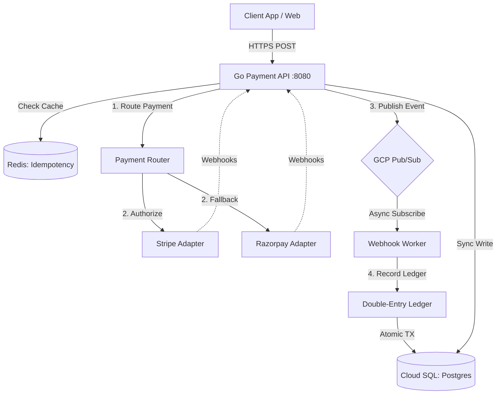
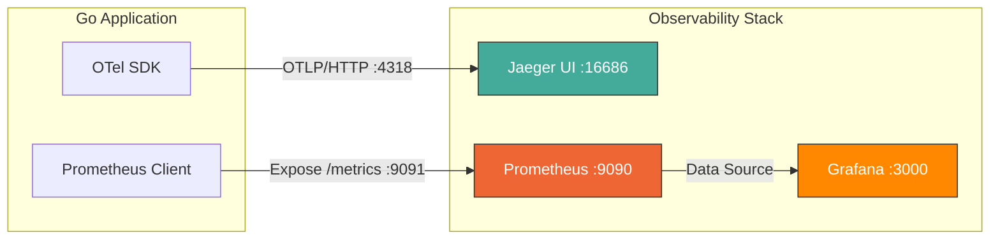
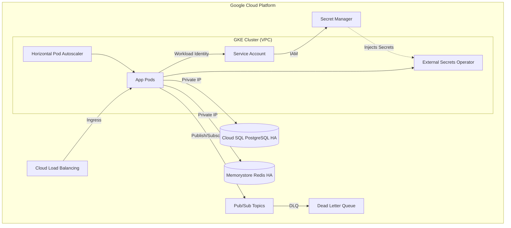
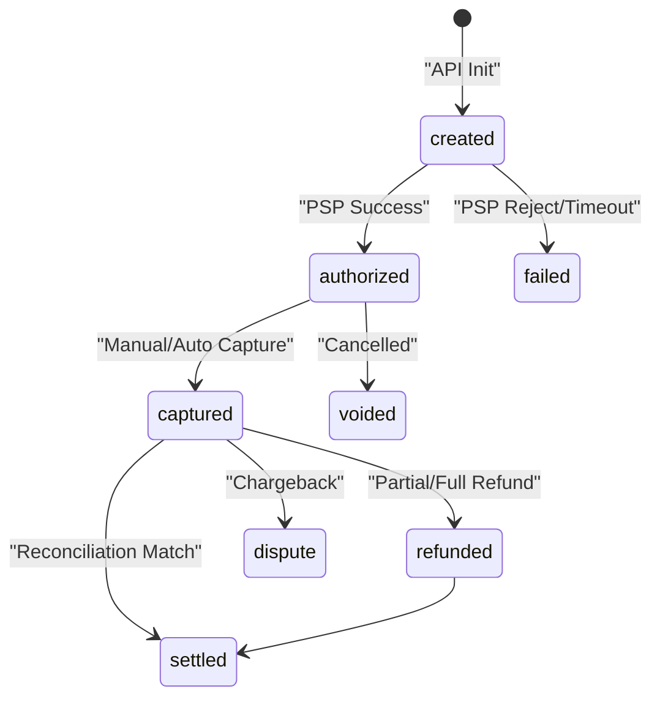
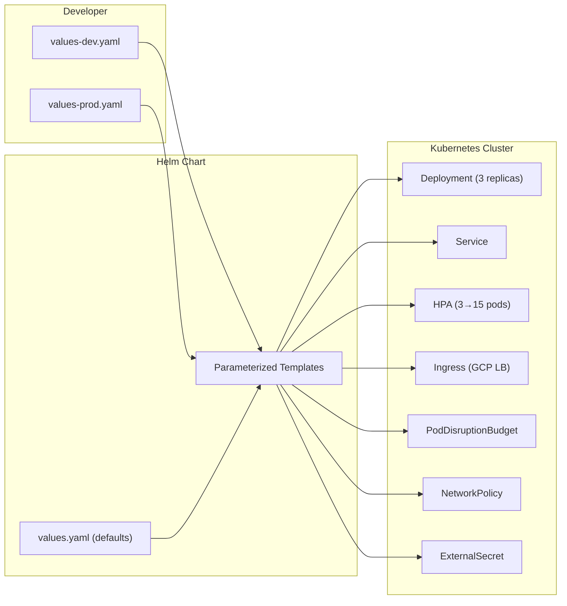

# Resilient Settlement Orchestrator

A production-grade **Payment Orchestration and Ledger System** built in Go that handles multi-PSP routing, double-entry bookkeeping, asynchronous webhook management, and automated reconciliation — with full distributed tracing, metrics, and Helm-based Kubernetes deployment.

Built for scale, fault tolerance, and high availability on Google Cloud Platform using Google Kubernetes Engine, Cloud SQL, and Pub/Sub.

## Key Capabilities

* **Multi-PSP Abstraction** : Unified interface for Stripe, Razorpay, and other PSPs.
* **Intelligent Routing** : Rule-based payment routing with cost optimization and automatic fallback capabilities.
* **Double-Entry Ledger** : Financial-grade bookkeeping guaranteeing atomic consistency and balance integrity.
* **Resilience Patterns** : Circuit breakers, retries with exponential backoff, and distributed idempotency.
* **Asynchronous Webhook Processing** : High-throughput, signature-verified webhook handling with Dead Letter Queues (DLQ) via Google Cloud Pub/Sub.
* **Reconciliation Engine** : Automated detection of discrepancies between internal ledger records and external PSP settlements.
* **Complete Audit Trail** : Immutable records of every state transition, ledger entry, and incoming webhook.
* **Enterprise Security** : Google Workload Identity Federation, GCP Secret Manager integration, TLS/mTLS, and strict rate limiting.
* **Full Observability** : OpenTelemetry distributed tracing, Prometheus metrics, Jaeger trace visualization, and Grafana dashboards.
* **Helm Chart Deployment** : Parameterized Kubernetes deployment with environment-specific overrides (dev/staging/prod).

## Technology Stack

| Domain | Technology |
|---|---|
| **Application Core** | Go 1.26, go-chi/chi v5 |
| **Database** | Google Cloud SQL (PostgreSQL 16), pgx v5 |
| **Caching & Idempotency** | Google Cloud Memorystore (Redis 7) |
| **Event Streaming** | Google Cloud Pub/Sub |
| **Distributed Tracing** | OpenTelemetry SDK → Jaeger (OTLP/HTTP) |
| **Metrics & Monitoring** | Prometheus (scraping) → Grafana (dashboards) |
| **Infrastructure as Code** | Terraform |
| **Container Orchestration** | Google Kubernetes Engine (GKE), Helm v3 |
| **CI/CD Pipeline** | GitHub Actions, Trivy Security Scans, Govulncheck |

## Architecture

### 1. High-Level System Flow



### 2. Observability Architecture



> **How it works:**
> - **OpenTelemetry SDK** instruments the Go code and exports trace spans via OTLP/HTTP to **Jaeger** for distributed tracing visualization.
> - **Prometheus** scrapes the internal `/metrics` endpoint on port `9091` every 5 seconds.
> - **Grafana** reads from Prometheus to render real-time dashboards (Payment Throughput, P99 Latency, Circuit Breaker status, etc.).

### 3. Cloud Infrastructure Diagram (GCP)



### 4. Payment State Machine



### 5. Helm Chart Deployment Flow



## Project Structure

```
.
├── cmd/server/              # Application entrypoint
│   └── main.go              # Server bootstrap, DI, route registration
├── internal/
│   ├── adapter/             # PSP adapters (Stripe, Razorpay, Mock)
│   ├── config/              # Environment-based configuration
│   ├── handler/             # HTTP handlers (payment, webhook, ledger, health)
│   ├── middleware/          # Auth, CORS, rate-limiting, idempotency, logging, security
│   ├── models/              # Domain models (Payment, LedgerEntry, etc.)
│   ├── pkg/
│   │   ├── circuitbreaker/  # Circuit breaker implementation
│   │   ├── metrics/         # Prometheus metrics (counters, histograms, gauges)
│   │   ├── retry/           # Exponential backoff retry logic
│   │   └── tracing/         # OpenTelemetry tracer + HTTP middleware
│   ├── pubsub/              # GCP Pub/Sub publisher and subscriber
│   └── service/             # Business logic (payment, ledger, router, webhook)
├── migrations/              # PostgreSQL schema migrations
├── monitoring/
│   ├── prometheus.yml       # Prometheus scrape config
│   └── grafana/             # Grafana dashboards and provisioning
│       ├── dashboards/      # Payment Orchestrator dashboard JSON
│       └── provisioning/    # Auto-provisioned datasources and dashboards
├── helm/
│   └── payment-orchestrator/
│       ├── Chart.yaml       # Helm chart metadata
│       ├── values.yaml      # Default configuration
│       ├── values-dev.yaml  # Dev/local overrides
│       ├── values-prod.yaml # Production overrides
│       └── templates/       # Parameterized K8s manifests
├── k8s/                     # Raw Kubernetes manifests (reference)
├── terraform/               # GCP infrastructure as code
├── .github/workflows/       # CI/CD pipelines
├── docker-compose.yml       # Local development environment
└── Dockerfile               # Multi-stage production build
```

## API Endpoints

### Payment Operations
* `POST /v1/payments` : Create payment (Supports Idempotency-Key)
* `GET /v1/payments/{id}` : Retrieve payment status
* `POST /v1/payments/{id}/capture` : Capture an authorized payment
* `POST /v1/payments/{id}/refund` : Refund a captured payment
* `POST /v1/payments/{id}/cancel` : Cancel an authorized payment

### Ledger Operations
* `GET /v1/ledger/accounts/{code}/balance` : Get current account balance
* `GET /v1/ledger/entries` : View recent atomic ledger entries

### Admin and Reconciliation
* `POST /v1/webhooks/{psp}` : Ingest PSP webhooks
* `POST /v1/admin/reconciliation/{psp}` : Trigger manual reconciliation
* `GET /v1/admin/reconciliation/{id}/discrepancies` : View sync mismatches
* `GET /v1/admin/dlq` : View Dead Letter Queue
* `POST /v1/admin/dlq/retry` : Retry failed webhooks

### Observability
* `GET /healthz` : Liveness probe
* `GET /readyz` : Readiness probe
* `GET /metrics` : Prometheus metrics (internal port 9091)

## Observability Stack

The project includes a complete, production-grade observability setup:

### OpenTelemetry + Jaeger (Distributed Tracing)
Every incoming HTTP request is traced end-to-end using OpenTelemetry. Spans cover:
- HTTP middleware (method, path, status code, latency)
- PSP adapter calls (Stripe/Razorpay authorization, capture, refund)
- Database operations (payment creation, ledger entries)
- Pub/Sub publishing

Access the Jaeger UI at **http://localhost:16686** to see waterfall trace visualizations.

### Prometheus + Grafana (Metrics & Dashboards)
The Go app exposes 15+ custom metrics on a separate internal port (`:9091`):
- `payment_requests_total` — Counter of all payment operations by type and status
- `http_request_duration_seconds` — Histogram of API latency (P50, P90, P99)
- `circuit_breaker_trips_total` — Counter of circuit breaker activations per PSP
- `webhook_processing_duration_seconds` — Histogram of webhook processing time
- `go_goroutines` — Active goroutine count

Access Grafana at **http://localhost:3000** (admin/admin) with a pre-provisioned **Payment Orchestrator** dashboard.

## Security and Compliance

Security is baked into the infrastructure and application layers:
* **Keyless Authentication**: GCP Workload Identity Federation replaces long-lived service account JSON keys.
* **Secret Management**: GCP Secret Manager holds database passwords and PSP API keys. Kubernetes External Secrets Operator injects them as ephemeral environment variables.
* **Network Isolation**: Cloud SQL and Redis run on private IPs without public internet access. NetworkPolicy restricts pod-to-pod communication.
* **Vulnerability Scanning**: CI/CD pipelines run Trivy and Govulncheck on every commit to block vulnerabilities from entering production.
* **Zero Trust APIs**: Strict Merchant API key validation and Rate Limiting (100 req/s) via Redis to prevent DDoS.
* **Container Hardening**: Non-root user, read-only filesystem, dropped capabilities, minimal Alpine base image.

## Local Development Setup

To run the full application with the observability stack locally:

```bash
# 1. Clone the repository
git clone https://github.com/Slambot01/resilient-settlement-orchestrator.git
cd resilient-settlement-orchestrator

# 2. Setup Environment Variables
cp .env.example .env

# 3. Spin up the full stack (7 containers)
# App, Postgres 16, Redis 7, Pub/Sub Emulator, Jaeger, Prometheus, Grafana
docker-compose up -d --build

# 4. Verify Health
curl http://localhost:8080/healthz

# 5. Create a test payment
curl -X POST http://localhost:8080/v1/payments \
  -H "Authorization: Bearer dev-admin-key" \
  -H "Content-Type: application/json" \
  -H "Idempotency-Key: test-001" \
  -d '{"amount":10000,"currency":"INR","order_id":"test-order-1","merchant_id":"merchant_abc"}'
```

### Access the UIs
| Service | URL | Credentials |
|---------|-----|-------------|
| **Payment API** | http://localhost:8080 | `Authorization: Bearer dev-admin-key` |
| **Jaeger (Tracing)** | http://localhost:16686 | — |
| **Grafana (Dashboards)** | http://localhost:3000 | admin / admin |
| **Prometheus** | http://localhost:9090 | — |

## Helm Chart Deployment

The project includes a production-ready Helm chart for Kubernetes deployment:

```bash
# Lint the chart
helm lint helm/payment-orchestrator

# Preview rendered templates (dev)
helm template my-release helm/payment-orchestrator \
  -f helm/payment-orchestrator/values-dev.yaml

# Preview rendered templates (production)
helm template my-release helm/payment-orchestrator \
  -f helm/payment-orchestrator/values-prod.yaml \
  -n payment-system

# Deploy to a cluster
helm install payment-prod helm/payment-orchestrator \
  -f helm/payment-orchestrator/values-prod.yaml \
  -n payment-system --create-namespace
```

### What the Helm Chart Includes
| Resource | Purpose |
|----------|---------|
| **Deployment** | App container + Cloud SQL Auth Proxy sidecar |
| **Service** | ClusterIP with HTTP (80) and metrics (9091) ports |
| **Ingress** | GCP HTTPS Load Balancer with optional TLS |
| **HPA** | Auto-scales 2→15 pods based on CPU/memory |
| **PDB** | Ensures minimum availability during node drains |
| **NetworkPolicy** | Firewall: ingress from LB, egress to DB/Redis/PSPs/Jaeger |
| **ExternalSecret** | Syncs GCP Secret Manager → K8s Secrets |
| **ServiceAccount** | GKE Workload Identity for keyless GCP auth |

## Performance Benchmarks

Load tested with [hey](https://github.com/rakyll/hey) using 10,000 requests at 50 concurrent connections against a local setup.

| Metric | Value |
|---|---|
| **Throughput** | 302 req/sec |
| **Avg Latency** | 153ms |
| **P90 Latency** | 203ms |
| **P99 Latency** | 517ms |
| **Success Rate** | 99.98% |

Note: The 0.02% error rate is intentional. The built-in Mock PSP simulates a 95% authorization success rate to validate the application's circuit breaker and retry logic under realistic failure conditions.

## License

MIT License
